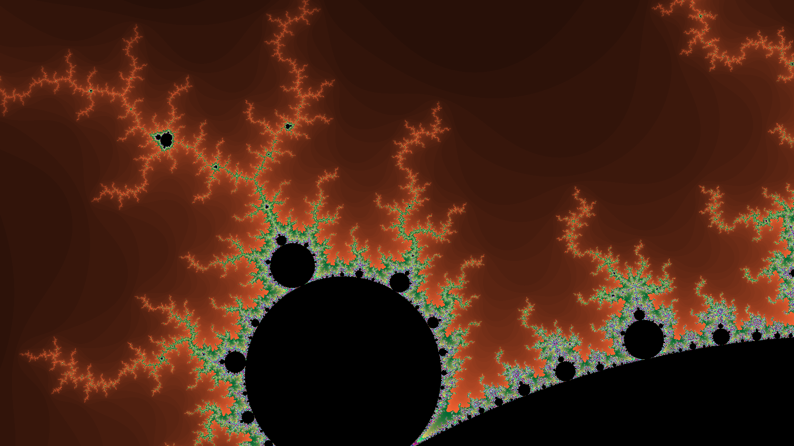
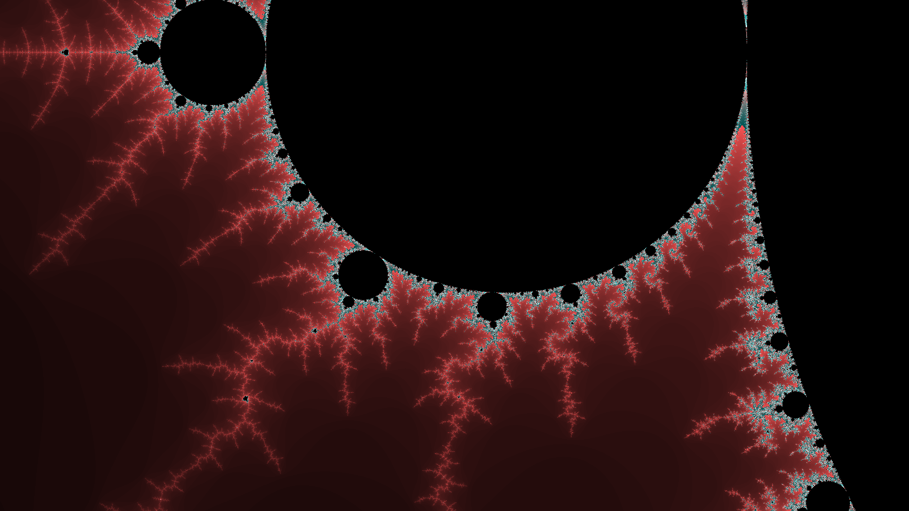
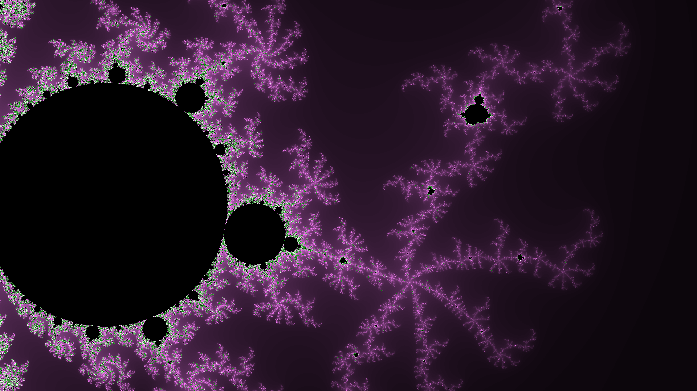

# PythonFractals
Uma aplicação em python para visualizar o conjunto de mandelbrot.

## Como faço para testar?

É uma aplicação em python, então precisar ter python3 instalado em algum lugar da sua máquina, para instalar os pacotes necessários use:

```
pip install -r requirements.txt
```
Basta executar o arquivo "main.py" para começar o programa.

## Controles:
    wasd : Translações;

    z : zoom out;

    x : zoom in;

    space: salvar uma imagem com maior qualidade;

## Exemplos
Aqui temos algumas imagens geradas pelo programa:







